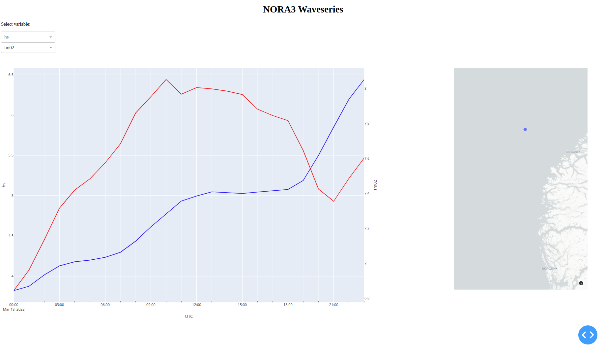

Welcome to dnplot's documentation!
=================================

**dnplot** is a Python package (under development) that creates various types of plots using the Matplotlib and Plotly libraries.

Import dnora and dnplot

.. code-block::python
    import dnora as dn
    import dnplot

Example for the wind, grid, spectra, spectra1d
===============================================

.. code-block::python

    grid = dn.grid.EMODNET(lon=(4, 6), lat=(59, 60))
    grid.set_spacing(dm=5000)
    grid.mesh_grid()
    model = dn.modelrun.NORA3(grid, year=2022, month=2, day=1)
    model.import_wind()
    model.import_spectra()
    model.spectra_to_1d()
    plot = dnplot.Dnora(model) or plot = dnplot.Plotly(model)

Grid plot using Matplotlib
---------------------------

.. code-block:: python
    plot.grid()

.. code-block:: python

    def grid_plotter(fig_dict: dict, model: ModelRun) -> dict:
        """Plot the depth information and set output points etc."""
        grid = model.grid()
        fig_dict = draw.draw_gridded_magnitude(
            fig_dict,
            grid.x(native=True),
            grid.y(native=True),
            grid.topo(),
            cmap=default_variable["topo"]["cmap"],
        )
        fig_dict = draw.draw_mask(
            fig_dict, grid.x(native=True), grid.y(native=True), grid.land_mask()
        )

        fig_dict["ax"].set_xlabel(grid.core.x_str)
        fig_dict["ax"].set_ylabel(grid.core.y_str)
        fig_dict["cbar"].set_label("Depth [m]")
        fig_dict["ax"].set_title(f"{grid.name} {grid.ds().attrs.get('source', '')}")

        # masks_to_plot = ["spectra_mask", "output_mask"]
        # fig_dict = draw.draw_masked_points(fig_dict, grid, masks_to_plot=masks_to_plot)

        objects_to_plot = [
            DnoraDataType.WIND,
        ]
        fig_dict = draw.draw_object_points(fig_dict, model, objects_to_plot=objects_to_plot)

        fig_dict.get("ax").legend()

        return fig_dic

Wind plot using Matplotlib
---------------------------

.. code-block:: python
    
    plot.wind()

.. code-block:: python

    def wind_plotter(fig_dict: dict, model: ModelRun) -> dict:
        def update_plot(val):
            nonlocal fig_dict
            nonlocal figure_initialized
            fig_dict = draw.draw_gridded_magnitude(
                fig_dict,
                wind.x(native=True),
                wind.y(native=True),
                wind.magnitude()[val, :, :],
                vmax=np.max(wind.magnitude()),
                vmin=0,
                cmap=default_variable["ff"]["cmap"],
            )
            fig_dict = draw.draw_coastline(fig_dict)
            fig_dict = draw.draw_arrows(
                fig_dict,
                wind.x(native=True),
                wind.y(native=True),
                wind.u()[val, :, :],
                wind.v()[val, :, :],
            )
            # if not figure_initialized:
            #     masks_to_plot = ["output_mask"]
            #     fig_dict = draw.draw_masked_points(fig_dict, grid, masks_to_plot=masks_to_plot)
            #     fig_dict.get("ax").legend()
            fig_dict["ax"].set_title(f"{wind.time(datetime=False)[val]} {wind.name}")
            figure_initialized = True

        wind = model.wind()
        grid = model.grid()
        figure_initialized = False
        if len(wind.time()) > 1:
            ax_slider = plt.axes([0.17, 0.05, 0.65, 0.03])
            time_slider = Slider(
                ax_slider, "time_index", 0, len(wind.time()) - 1, valinit=0, valstep=1
            )
            time_slider.on_changed(update_plot)

        update_plot(0)
        fig_dict["ax"].set_xlabel(wind.core.x_str)
        fig_dict["ax"].set_ylabel(wind.core.y_str)
        fig_dict["cbar"].set_label("Wind speed [m/s]")

        plt.show(block=True)

        return fig_dict

.. image:: files/wind_plt.gif
    :width: 500

Spectra Plot using Matplotlib
-----------------------------

.. code-block:: python

    plot.spectra()

.. code-block:: python

    def spectra_plotter(fig_dict: dict, model: ModelRun) -> dict:
        def update_plot(val):
            nonlocal fig_dict
            nonlocal figure_initialized
            fig_dict = draw.draw_polar_spectra(
                fig_dict,
                spectra.spec()[sliders["time"].val, sliders["inds"].val, :, :],
                spectra.freq(),
                spectra.dirs(),
            )

            fig_dict["ax"].set_title(
                f"{spectra.time(datetime=False)[sliders['time'].val]} {spectra.name}"
            )
            figure_initialized = True

        spectra = model.spectra()
        grid = model.grid()
        figure_initialized = False
        sliders = {}
        if len(spectra.time()) > 1:
            ax_slider = plt.axes([0.17, 0.05, 0.65, 0.03])
            sliders["time"] = Slider(
                ax_slider, "time_index", 0, len(spectra.time()) - 1, valinit=0, valstep=1
            )
            sliders["time"].on_changed(update_plot)
        if len(spectra.inds()) > 1:
            ax_slider2 = plt.axes([0.17, 0.01, 0.65, 0.03])
            sliders["inds"] = Slider(
                ax_slider2, "inds_index", 0, len(spectra.x()) - 1, valinit=0, valstep=1
            )
            sliders["inds"].on_changed(update_plot)
        update_plot(0)
        # fig_dict['ax'].set_xlabel(wind.core.x_str)
        # fig_dict['ax'].set_ylabel(wind.core.y_str)
        # fig_dict['cbar'].set_label('Wind speed [m/s]')

        plt.show(block=True)

        return fig_dict

Spectra1D Plot using Matplotlib
-------------------------------

.. code-block:: python
    
    plot.spectra1d()

.. code-block:: python

    def spectra1d_plotter(fig_dict: dict, model: ModelRun) -> dict:
        def update_plot(val):
            nonlocal fig_dict
            nonlocal figure_initialized
            ax=fig_dict['ax']
            ax2=fig_dict['ax2']
            ax.cla()
            ax2.cla()
            dirm=None
            spr=None
            if spectra1d.dirm() is not None:
                dirm=spectra1d.dirm()[sliders["time"].val, sliders["inds"].val, :]
            if spectra1d.spr() is not None:
                spr=spectra1d.spr()[sliders["time"].val, sliders["inds"].val, :]
                
            fig_dict = draw.draw_graph_spectra1d(
                fig_dict,
                spectra1d.spec()[sliders["time"].val, sliders["inds"].val, :],
                spectra1d.freq(),
                dirm,
                spr,
            )

            ax.set_ylim(0, np.max(spectra1d.spec()[:,sliders['inds'].val,:])*1.1)
            ax.set_title(spectra1d.name, fontsize=16)
            ax.set_xlabel('Frequency')
            ax.set_ylabel(f"{spectra1d.meta.get('spec').get('long_name')}\n {'E(f)'}", color='b')
            ax2.set_ylim(0, np.max(spectra1d.dirm())*1.1)
            ax2.set_ylabel(f"{spectra1d.meta.get('dirm').get('long_name')}\n {spectra1d.meta.get('dirm').get('unit')}",color='g')
            ax2.yaxis.set_label_position('right')
            ax2.yaxis.tick_right()
            ax.grid()
            figure_initialized = True

        spectra1d = model.spectra1d()
        grid = model.grid()
        figure_initialized = False
        sliders = {}
        if len(spectra1d.time()) > 1:
            ax_slider = plt.axes([0.17, 0.05, 0.65, 0.03])
            sliders["time"] = Slider(
                ax_slider, "time_index", 0, len(spectra1d.time()) - 1, valinit=0, valstep=1
            )
            sliders["time"].on_changed(update_plot)
        if len(spectra1d.inds()) > 1:
            ax_slider2 = plt.axes([0.17, 0.01, 0.65, 0.03])
            sliders["inds"] = Slider(
                ax_slider2, "inds_index", 0, len(spectra1d.x()) - 1, valinit=0, valstep=1
            )
            sliders["inds"].on_changed(update_plot)
        update_plot(0)
        plt.show(block=True)
        return fig_dict

.. image:: files/spectra1d_plt.png
    :width: 500

Spectra Plot using Plotly
-------------------------

.. code-block:: python

    plot.spectra()

.. code-block:: python

    def spectra_plotter(model: ModelRun):
        spectra=model.spectra()
        spectra1d = model.spectra1d()
        time = {
            'time': spectra.time(),
        }
        inds = {
            'inds': spectra.inds(),
        }
        time_df = pd.DataFrame(time)
        time_df['time'] = pd.to_datetime(time_df['time'])
        time_df['hour'] = time_df['time'].dt.hour
        inds_df = pd.DataFrame(inds)
        
        app = Dash(__name__)
        
        app.layout = html.Div([
            html.H1(id="title", style={'textAlign': 'center'}),
            html.H2(id='smaller_title', style={'textAlign': 'center'}),
            
            html.Label("time_index"),
            dcc.Slider(
                min=time_df['hour'].min(),
                max=time_df['hour'].max(),
                step=1,
                value=time_df['hour'].min(),
                tooltip={"placement": "bottom", "always_visible": True},
                updatemode='drag',
                persistence=True,
                persistence_type='session',
                id='time_slider',
            ),
            html.Label("inds_index"),
            dcc.Slider(
                min=inds_df['inds'].min(),
                max=inds_df['inds'].max(),
                step=1,
                value=inds_df['inds'].min(),
                tooltip={"placement": "bottom", "always_visible": True},
                updatemode='drag',
                persistence=True,
                persistence_type='session',
                id='inds_slider',
            ),
            html.Div([
                dcc.Graph(id="spectra1d_graph"),
                dcc.Graph(id="spectra2d_graph")
            ],style={'display': 'flex', 'flexDirection': 'column', 'width': '50%', 'float': 'left'}),

            html.Div([
                dcc.Graph(id="spectra_map")
            ], style={'width': '50%', 'float': 'right'})
        ])
        
        @app.callback(
            [Output('title','children'),
            Output('smaller_title', 'children'),
            Output("spectra1d_graph", "figure"),
            Output('spectra_map','figure'),
            Output("spectra2d_graph", "figure")],
            [Input("time_slider", "value"),
            Input("inds_slider", "value")],
        )
        def display_spectra(time_r, inds_r):
            selected_time_df = time_df[time_df["hour"] == time_r]
            spec1=spectra.spec()[:, inds_r, :, :].flatten()
            spec1d=spectra1d.spec()[:, inds_r, :].flatten()

            fig_right=draw_plotly_graph_spectra(
                freq=spectra.freq(),
                spec=spectra.spec()[selected_time_df.index[0], inds_r, :, :].flatten(),
                dirs=spectra.dirs(),
                cmin=np.min(spec1),
                cmax=np.max(spec1),
            )
            fig_right.update_layout(
                width=900,
                height=900,
                margin=dict(
                    l=200,r=0,t=100,b=50
                ),
            )

            fig_right2=draw_scatter_mapbox(
                lat=spectra.lat(),
                lon=spectra.lon(),
                lat_ind=spectra.lat()[inds_r],
                lon_ind=spectra.lon()[inds_r]
                )
            fig_right2.update_layout(
                width=1000,
                height=500,
                margin=dict(
                    l=50,r=0,t=10,b=50
                )
            )
            fig_left=draw_plotly_graph_spectra1d(
                freq=spectra1d.freq(),
                spec=spectra1d.spec()[selected_time_df.index[0], inds_r, :],
                dirm=spectra1d.dirm()[selected_time_df.index[0], inds_r, :] if spectra1d.dirm() is not None else None,
                spr=spectra1d.spr()[selected_time_df.index[0], inds_r, :] if spectra1d.spr() is not None else None)
            fig_left.update_layout(
                xaxis_title=f"{spectra1d.meta.get('freq').get('long_name')}",
                yaxis=dict(
                    title=f"{spectra1d.meta.get('spec').get('long_name')}\n {'E(f)'}",
                    range=[0,np.max(spec1d)*1.1]
                ),
                yaxis2=dict(
                    title=f"{spectra1d.meta.get('dirm').get('long_name')}\n ({spectra1d.meta.get('dirm').get('unit')})",
                    overlaying='y',
                    side='right',
                    range=[0,np.max(spectra1d.dirm())*1.1],
                ),
                width=1000,
                height=500,
                margin=dict(
                    l=100,r=0,t=100,b=50
                )
            )
            title = f"{spectra.time(datetime=False)[selected_time_df.index[0]]} {spectra.name}"
            smaller_title = f"Latitude={spectra1d.lat()[inds_r]:.4f} Longitude={spectra1d.lon()[inds_r]:.4f}"
            
            return title, smaller_title, fig_left, fig_right, fig_right2
        port = random.randint(1000, 9999)
        Timer(1, open_browser, args=[port]).start()
        app.run_server(debug=True, port=port)

Spectra1D Plot using Plotly
----------------------------

.. code-block:: python

    plot.spectra1d()

.. code-block:: python

    def spectra1d_plotter(model: ModelRun):
        spectra1d = model.spectra1d()

        time = {
            'time': spectra1d.time(),
        }
        inds = {
            'inds': spectra1d.inds(),
        }
        time_df = pd.DataFrame(time)
        time_df['time'] = pd.to_datetime(time_df['time'])
        time_df['hour'] = time_df['time'].dt.hour
        
        inds_df = pd.DataFrame(inds)
        
        app = Dash(__name__)
        
        app.layout = html.Div([
            html.H1(id="title", style={'textAlign': 'center'}),
            html.H2(id='smaller_title', style={'textAlign': 'center'}),
            
            html.Label("time_index"),
            dcc.Slider(
                min=time_df['hour'].min(),
                max=time_df['hour'].max(),
                step=1,
                value=time_df['hour'].min(),
                tooltip={"placement": "bottom", "always_visible": True},
                updatemode='drag',
                persistence=True,
                persistence_type='session',
                id='time_slider',
            ),
            
            html.Label("inds_index"),
            dcc.Slider(
                min=inds_df['inds'].min(),
                max=inds_df['inds'].max(),
                step=1,
                value=inds_df['inds'].min(),
                tooltip={"placement": "bottom", "always_visible": True},
                updatemode='drag',
                persistence=True,
                persistence_type='session',
                id='inds_slider',
            ),
            html.Div([
                dcc.Graph(id="spectra1d_graph"),

            ]),
        ])
        
        @app.callback(
            [Output('title','children'),
            Output('smaller_title', 'children'),
            Output("spectra1d_graph", "figure")],
            [Input("time_slider", "value"),
            Input("inds_slider", "value")],
        )
        def display_spectra1d(time_r, inds_r):
            selected_time_df = time_df[time_df["hour"] == time_r]
            spec1d=spectra1d.spec()[:, inds_r, :].flatten()

            fig=draw_plotly_graph_spectra1d(
                freq=spectra1d.freq(),
                spec=spectra1d.spec()[selected_time_df.index[0], inds_r, :],
                dirm=spectra1d.dirm()[selected_time_df.index[0], inds_r, :] if spectra1d.dirm() is not None else None,
                spr=spectra1d.spr()[selected_time_df.index[0], inds_r, :] if spectra1d.spr() is not None else None)
            fig.update_layout(
                xaxis_title=f"{spectra1d.meta.get('freq').get('long_name')}",
                yaxis=dict(
                    title=f"{spectra1d.meta.get('spec').get('long_name')}\n {'E(f)'}",
                    range=[0, (np.max(spec1d)*1.1)],
                ),
                yaxis2=dict(
                    title=f"{spectra1d.meta.get('dirm').get('long_name')}\n ({spectra1d.meta.get('dirm').get('unit')})",
                    overlaying='y',
                    side='right',
                    range=[0,(np.max(spectra1d.dirm())*1.1)],
                ),
                width=1800,
                height=800,
                margin=dict(
                    l=0,r=0,t=20,b=0
                )
            )
            title = f"{spectra1d.time(datetime=False)[selected_time_df.index[0]]} {spectra1d.name}"
            smaller_title = f"Latitude={spectra1d.lat()[inds_r]:.4f} Longitude={spectra1d.lon()[inds_r]:.4f}"
            return title, smaller_title, fig,
        
        port = random.randint(1000, 9999)
        Timer(1, open_browser, args=[port]).start()
        app.run_server(debug=True, port=port)

Example for the scatter plot
=============================

.. code-block:: python

    #Plots a scatter plot 
    e39 = dn.modelrun.ModelRun(year=2019, month=3)
    e39.import_waveseries(dn.waveseries.read.E39(loc="D"), point_picker=dn.pick.Trivial())

    point = dn.grid.Grid(lon=e39.waveseries().lon(), lat=e39.waveseries().lat())
    nora3 = dn.modelrun.NORA3(point, year=2019, month=3)
    nora3.import_spectra()
    nora3.spectra_to_waveseries()
    plot = dnplot.Dnora1(nora3, e39) or plot = dnplot.Plotly1(nora3,e39) 

Scatter Plot using Matplotlib
------------------------------

.. code-block::python

    plot.scatter(['hs','hs'])

.. code-block::python

    def scatter1_plotter(fig_dict: dict, model: ModelRun, model1: ModelRun, var):
        ds_model=model.waveseries()
        ds1_model1=model1.waveseries()
        x = var[0]
        y = var[1]
        df_model=xarray_to_dataframe(ds_model)
        df1_model1=xarray_to_dataframe(ds1_model1)
        combined_df = pd.concat([df_model, df1_model1], axis=1)

        combined_df_cleaned = combined_df.dropna()

        df_model = combined_df_cleaned.iloc[:, :df_model.shape[1]].reset_index(drop=True)
        df1_model1 = combined_df_cleaned.iloc[:, df_model.shape[1]:].reset_index(drop=True)
        correlation=calculate_correlation(df_model[x],df1_model1[y])

        RMSE=calculate_RMSE(df_model[x],df1_model1[y])
        SI=RMSE/df_model[x].mean()
        X = df_model[x].values.reshape(-1,1)
        linear=LinearRegression()
        linear.fit(X,df1_model1[y])

        x_range = np.linspace(0, np.ceil(X.max()), 100)
        y_range = linear.predict(x_range.reshape(-1, 1))
        # Text on the figure
        text = '\n'.join((
            f'N={len(df_model)}',
            f'Bias{df_model[x].mean() - df1_model1[y].mean():.4f}',
            f'R\u00b2={correlation:.4f}',
            f'RMSE={RMSE:.4f}',
            f'SI={SI:.4f}',
        ))
        # color for scatter density
        xy = np.vstack([df_model[x].values, df1_model1[y].values])
        z = gaussian_kde(xy)(xy)
        norm = Normalize(vmin=z.min(), vmax=z.max())
        cmap = cm.jet 
        sm = cm.ScalarMappable(cmap=cmap, norm=norm)
        sm.set_array([])

        title=rf"$\bf{{{ds_model.name}}}$" + "\n" + rf"{x} vs {y}"
        fig_dict['ax'].set_title(title, fontsize=14)
        fig_dict['ax'].scatter(df_model[x], df1_model1[y], c=z,cmap=cmap, norm=norm,s=50)
        x_max=np.ceil(df_model[x].max())
        y_max=np.ceil(df1_model1[y].max())

        if x_max > y_max:
            fig_dict['ax'].set_ylim([0, x_max])
            fig_dict['ax'].set_xlim([0, x_max])
        else: 
            fig_dict['ax'].set_xlim([0, y_max])
            fig_dict['ax'].set_ylim([0, y_max])

        fig_dict['ax'].plot(x_range, y_range, color='red', linewidth=2, label='Regression line')

        x_line=np.linspace(0,np.ceil(df_model[x].max()), 100)
        a=np.sum(df_model[x]*df1_model1[y])/np.sum(df_model[x]**2)
        y_line=a*x_line

        fig_dict['ax'].plot(x_line,y_line, linewidth=2, label='One parameter line')

        x_values = np.linspace(0, np.ceil(df_model[x].max()), 100)
        y_values = x_values
        fig_dict['ax'].plot(x_values, y_values, linewidth=2, label='x=y')
        
        fig_dict['ax'].set_xlabel(f"{ds_model.meta.get(x)['long_name']}\n ({ds_model.meta.get(x)['unit']})")
        fig_dict['ax'].set_ylabel(f"{ds1_model1.meta.get(y)['long_name']}\n ({ds1_model1.meta.get(y)['unit']})")
        
        #color bar
        cbar = plt.colorbar(sm, ax=fig_dict['ax'])
        cbar.set_label('Density', rotation=270, labelpad=15)
        
        props = dict(boxstyle='square', facecolor='white', alpha=0.6)
        ax=plt.gca()
        fig_dict['ax'].text(
            0.005, 0.90, text, bbox=props, fontsize=12,
            transform=ax.transAxes, verticalalignment='top',
            horizontalalignment='left'
        )
        fig_dict['ax'].grid(linestyle='--')
        fig_dict['ax'].legend(loc='upper left')
        plt.show(block=True)

.. image::files/scatter_plt.png
    :width: 500

Scatter Plot using Plotly
-------------------------

.. code-block:: python

    plot.scatter()

.. code-block:: python

    def scatter_plotter(model: ModelRun, model1:ModelRun):
        ds_model=model.waveseries()
        ds1_model1=model1.waveseries()
        df_model=xarray_to_dataframe(model.waveseries())
        df1_model1=xarray_to_dataframe(model1.waveseries())

        common_columns = list(set(df_model.columns).intersection(set(df1_model1.columns)))
        df = pd.merge(df_model[common_columns], df1_model1[common_columns], on='time', suffixes=(f' {ds_model.name}',  f' {ds1_model1.name}'))
        first_column=df.pop('time')
        df.insert(0,'time',first_column)
        df_column=[col for col in df.columns if col.endswith(f' {ds_model.name}')]
        df1_column=[col for col in df.columns if col.endswith(f' {ds1_model1.name}')]
        df_noNa=df.dropna().reset_index(drop=True)
        app = Dash(__name__)
        app.layout = html.Div([
            html.H1(ds_model.name, style={'textAlign': 'center'}),
            html.P("Select variable:"),
            dcc.Dropdown(
                id="x-axis-dropdown",
                options = [{'label': col, 'value': col} for col in df_column],
                value=f'hs {ds_model.name}',
                clearable=False,
                style={'width': '30%'}, 
            ),
            dcc.Dropdown(
                id="y-axis-dropdown",
                options=[{'label': col, 'value': col} for col in df1_column],
                value=f'hs {ds1_model1.name}',
                clearable=False,
                style={'width': '30%'},
            ),
            dcc.Graph(id="scatter_graph"),
        ])
        
        @app.callback(
            Output("scatter_graph", "figure"),
            Input("x-axis-dropdown", "value"),
            Input("y-axis-dropdown", "value"), 
        )
        def update_graph(x_var,y_var):
            x_col=f'{x_var}'
            y_col=f'{y_var}'
            """
            Calculates the correlation
            """
            correlation=calculate_correlation(df_noNa[x_col],df_noNa[y_col])
            """
            Calculates RMSE
            Calculates SI
            """
            RMSE=calculate_RMSE(df_noNa[x_col],df_noNa[y_col])
            SI=RMSE/df_noNa[x_col].mean()
            """
            Stack values and
            Calculates density.
            """
            xy = np.vstack([df_noNa[x_col].values, df_noNa[y_col].values])
            z = gaussian_kde(xy)(xy)

            if x_col not in df.columns or y_col not in df.columns:
                return go.Figure()
            fig = px.scatter(df_noNa, x=x_col, y=y_col,color=z, color_continuous_scale='jet')

            linear_regression_line(df_noNa[x_col],df_noNa[y_col],fig)

            x_max=np.ceil(df_noNa[x_col].max())
            y_max=np.ceil(df_noNa[y_col].max())

            x_values = np.linspace(0, np.ceil(x_max), 100)
            y_values = x_values
            fig.add_traces(go.Scatter(x=x_values, y=y_values, mode='lines', name='x=y',visible='legendonly'))

            x_line=np.linspace(0,np.ceil(x_max), 100)
            a=np.sum(df_noNa[x_col]*df_noNa[y_col])/np.sum(df_noNa[x_col]**2)
            y=a*x_line
            fig.add_traces(go.Scatter(x=x_line, y=y, mode='lines', name='one-parameter-linear regression',visible='legendonly'))

            if x_max > y_max:
                fig.update_layout(
                    yaxis=dict(range=[0, x_max]),
                    xaxis=dict(range=[0, x_max])
                )
            else: 
                fig.update_layout(
                    xaxis=dict(range=[0, y_max]),
                    yaxis=dict(range=[0, y_max])
                )
            fig.update_layout(
                coloraxis_colorbar=dict(
                    title='Density',
                    y=0.45, x=1.015,
                    len=0.9
                ),
                annotations=[
                    dict(
                        x=0.001,y=0.995,
                        xref='paper',
                        yref='paper',
                        text=(
                            f'N = {len(df_noNa[x_col])} '
                            f'Bias = {df_noNa[x_col].mean() - df_noNa[y_col].mean():.4f} '
                            f'R\u00b2= {correlation:.4f} '
                            f'RMSE= {RMSE:.4F} '
                            f'SI= {SI:.4F}'
                        ),
                        showarrow=False,
                        font=dict(size=16, color='black'),
                        align='left',
                        bgcolor='white',
                        borderpad=4,
                        bordercolor='black',
                        opacity=0.55
                    )
                ]
            )
            fig.update_layout(
                width=1800,
                height=900,
                margin=dict(
                    l=0,r=0,t=40,b=0
                )
            )
            return fig
        
        port = random.randint(1000, 9999)
        Timer(1, open_browser, args=[port]).start()
        app.run_server(debug=True, port=port)
    

Example for the waveseries plot
===============================

.. code-block:: python

    #plots a waveseries plot
    point = dn.grid.Grid(lon=4.308, lat=62.838, name="Svinoy")
    model = dn.modelrun.NORA3(point, year=2022, month=3, day=18)
    model.import_spectra()
    model.spectra_to_waveseries()
    model.waveseries()
    plot = dnplot.Dnora(model) or plot = dnplot.Plotly(model)

Waveseries Plot using Matplotlib
--------------------------------

There are two types of wave series plots, depending on the number of variables you have. 

If you have more than 3 variables, where (var1, var2) are treated as one, you will be given 4 different figures with the chosen variables. 

If you have 3 or fewer variables, you will receive a single figure with labels corresponding to the selected variables.

Code
----

.. code-block::python

    plot.waveseries([('hs','tm01'),('hs', 'tm01'), 'hs'])
    plot.waveseries([('hs','tm01'),('hs', 'tm01'),('hs','dirm') 'hs'])

.. code-block:: python

    def waveseries_plotter(model: ModelRun, var):
        ts = model.waveseries()
        if len(var) < 4:
            fig, axes = plt.subplots(len(var), 1)
            fig.suptitle(ts.name,fontsize=16)
            axes = axes if len(var) > 1 else [axes] 
            for i, item in enumerate(var):
                if isinstance(item, tuple):
                    var1, var2 = item
                    ax=axes[i]
                    ax.plot(ts.get('time'),ts.get(var1),color='b',label=f"{var1} ({ts.meta.get(var1)['unit']})")
                    
                    ax.set_ylabel(f"{ts.meta.get(var1)['long_name']}\n ({ts.meta.get(var1)['unit']})",color='b')
                    ax.set_xlabel('UTC',fontsize=12)
                    ax2=ax.twinx()
                    ax2.plot(ts.get('time'),ts.get(var2),color='g',label=f"{var2} ({ts.meta.get(var2)['unit']})")
                    ax2.set_ylabel(f"{ts.meta.get(var2)['long_name']}\n ({ts.meta.get(var2)['unit']})",color='g')
                    lines1, labels1 = ax.get_legend_handles_labels()
                    lines2, labels2 = ax2.get_legend_handles_labels()
                    ax2.legend(lines1 + lines2, labels1 + labels2)
                    ax.grid(True)
                
                else:
                    axes[i].plot(ts.get('time'),ts.get(item),color='b',label=f"{item} ({ts.meta.get(item)['unit']})")
                    axes[i].set_ylabel(f"{ts.meta.get(item)['long_name']} \n ({ts.meta.get(item)['unit']})")
                    axes[i].set_xlabel('UTC',fontsize=12)
                    axes[i].legend()
                    axes[i].grid(True)

        else:
            for item in var:
                fig, ax = plt.subplots()
                if isinstance(item, tuple):
                    var1, var2 = item
                    ax.plot(ts.get('time'),ts.get(var1),color='b',label=f"{var1} ({ts.meta.get(var1)['unit']})")

                    ax.set_ylabel(f"{ts.meta.get(var1)['long_name']}\n ({ts.meta.get(var1)['unit']})",color='b')
                    ax.set_xlabel('UTC',fontsize=12)
                    ax2=ax.twinx()
                    ax2.plot(ts.get('time'),ts.get(var2),color='g',label=f"{var2} ({ts.meta.get(var2)['unit']})")
                    ax2.set_ylabel(f"{ts.meta.get(var2)['long_name']}\n ({ts.meta.get(var2)['unit']})",color='g')
                    lines1, labels1 = ax.get_legend_handles_labels()
                    lines2, labels2 = ax2.get_legend_handles_labels()
                    ax2.legend(lines1 + lines2, labels1 + labels2)
                    ax.grid(True)
                else:
                    ax.plot(ts.get('time'),ts.get(item),color='b',label=f"{item} ({ts.meta.get(item)['unit']})")
                    ax.set_xlabel('UTC',fontsize=12)
                    ax.set_ylabel(f"{ts.meta.get(item)['long_name']} \n ({ts.meta.get(item)['unit']})")
                    ax.legend()
                    ax.grid(True)
                ax.set_title(ts.name,fontsize=16)
            
        plt.tight_layout()
        plt.show(block=True)

Waveseries when variables are 3 or less:

.. image:: files/waveseries_plt3.png
    :width: 500

Waveseries when variables are more than 3:

Waveseries Plot using Plotly
----------------------------

.. code-block:: python

    plot.waveseries(use_dash=True)

You can plot wave series with drop-down buttons by setting use_dash=True,
or without them by setting use_dash=False.

.. code-block:: python

    def waveseries_plotter_basic(model: ModelRun):
        ts = model.waveseries()
        var=xarray_to_dataframe(ts)
        fig = go.Figure()

        variables = [col for col in var.columns if col != 'time']

        for variable in variables:
            trace = go.Scatter(x=var['time'], y=var[variable], mode='lines', name=variable, visible='legendonly')
            fig.add_trace(trace)

        fig.update_layout(
            title=f'{ts.name}',
            xaxis_title='UTC',
            yaxis_title='Values'
        )
        fig.show()

    def waveseries_plotter_dash(model: ModelRun):
        ts = model.waveseries()
        var=xarray_to_dataframe(ts)
        app = Dash(__name__)
        app.layout = html.Div([
            html.H1(id="title", style={'textAlign': 'center'}),
            html.P("Select variable:"),
            dcc.Dropdown(
                id="waveseries-1",
                options=[
                    {'label': col, 'value': col} for col in var if col!='time'
                ],
                value="hs",
                clearable=False,
                style={'width': '30%'},
            ),
            dcc.Dropdown(
                id="waveseries-2",
                options=[
                    {"label": "None", "value": "None"}] +
                    [{'label': col, 'value': col} for col in var if col!='time'
                ],
                value="None",
                clearable=False,
                style={'width': '30%'},
            ),
            dcc.Graph(id="waveseries_chart"),
        ])

        @app.callback(
            Output("waveseries_chart", "figure"), 
            Output('title','children'),
            Input("waveseries-1", "value"), 
            Input("waveseries-2", "value")
        )
        def display_time_series(ticker1, ticker2):
            subfig = make_subplots(specs=[[{"secondary_y": True}]])
            fig = px.line(var, x='time', y=ticker1)
            subfig.add_trace(fig.data[0], secondary_y=False)
            if ticker2 != "None":
                fig2 = px.line(var, x='time', y=ticker2)
                subfig.add_trace(fig2.data[0], secondary_y=True)
                subfig.update_traces(line_color='blue', secondary_y=False)
                subfig.update_traces(line_color='red', secondary_y=True)
                subfig.update_xaxes(minor=dict(ticks="inside", showgrid=True))
                subfig.update_yaxes(secondary_y=True, showgrid=False)
                subfig.update_layout(xaxis_title="UTC", yaxis_title=ticker1)
                subfig.update_yaxes(title_text=ticker2, secondary_y=True)
            else:
                subfig.update_layout(xaxis_title="UTC", yaxis_title=ticker1)
            subfig.update_layout(
                width=1800,
                height=900,
                margin=dict(
                    l=100,r=0,t=100,b=100
                ),
            )
            fig=go.Figure(go.Scattermapbox(
                lat=ts.lat(),
                lon=ts.lon(),
                mode='markers',
                marker=dict(size=12),
            ))
            fig.update_layout(
                mapbox=dict(
                    style='carto-positron',
                    center=dict(lat=int(ts.lat()),lon=int(ts.lon())),
                    zoom=6,
                ),
                width=450,
                height=850,
                margin=dict(
                    l=0,r=0,t=50,b=50
                )
            )
            title = f"{ts.name} Waveseries"
            return subfig, title
        port = random.randint(1000, 9999)
        Timer(1, open_browser, args=[port]).start()
        app.run_server(debug=True, port=port)

    def waveseries_plotter(model: ModelRun, use_dash: bool):
            if use_dash:
                waveseries_plotter_dash(model)
            else:
                waveseries_plotter_basic(model)

You can plot wave series with drop-down buttons by setting use_dash=True,
or without them by setting use_dash=False.

Waveseries use_dash=True:

Waveseries use_dash=False:

